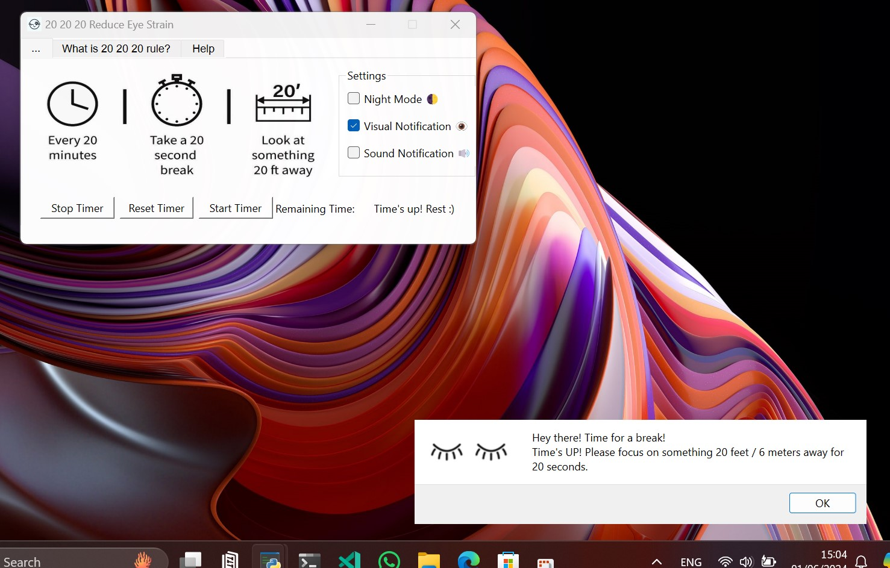

# Reduce your eye strain with 20 20 20 Method!
A useful application to apply 20 20 20 method for reduce your eye strain!

The 20-20-20 application is a highly beneficial tool designed to help mitigate eye strain, a common issue for individuals who spend significant time in front of screens. The application implements the 20-20-20 rule, a widely recommended approach by eye care professionals for reducing eye strain. The rule suggests that every 20 minutes, you should take a break and look at something 20 feet away for 20 seconds. Our application assists in this process by providing timely reminders to take these crucial breaks, helping to protect your eyes and enhance your overall eye health.

# Note
The application is currently development phase.

<a href="https://github.com/mcagriaksoy/20_20_20_eye_strain/releases/"></a>

# Usage

1 - Start timer and observe the 20 minute timer has been started.
2 - In background it counts down till the 20 minute is passed.
3 - The program is displaying a popup or notification to remind break time!
    - You need to focus at least 6 meter remote to reduce your eye strain for at least 20 seconds.
4 - After 20 seconds the popup will be closed and 20 minute timer starts again.

# UI


# Supported OS(s)

[](https://www.linux.org/ "Go to Linux homepage")
[](https://www.microsoft.com/ "Go to Microsoft homepage")

Simply run python source code or call the executable.

```
python main.py
```


# Dependencies

[](https://wiki.python.org/moin/PyQt)
[](https://pypi.org/project/PyQt6-sip/)
