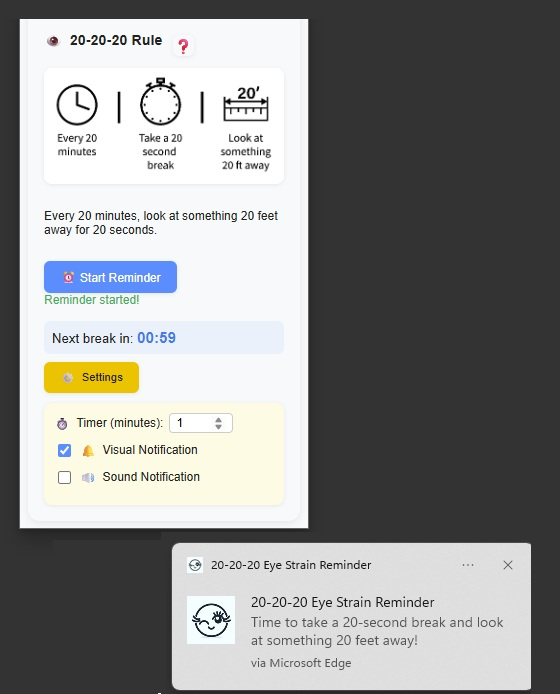

# Reduce your eye strain with 20 20 20 Method!
A useful application to apply 20 20 20 method for reduce your eye strain!

The 20-20-20 application is available in two versions:
1. **Python Desktop Application** - A standalone desktop application for Windows and Linux
2. **Chromium Browser Extension** - A lightweight browser extension for Chrome, Edge, and other Chromium-based browsers

Both implementations follow the 20-20-20 rule, a widely recommended approach by eye care professionals for reducing eye strain. The rule suggests that every 20 minutes, you should take a break and look at something 20 feet away for 20 seconds. Our applications assist in this process by providing timely reminders to take these crucial breaks, helping to protect your eyes and enhance your overall eye health.

# Note
The application is currently development phase.

<a href="https://github.com/mcagriaksoy/20_20_20_eye_strain/releases/"></a>

# Usage

## Python Desktop Application
1 - Start timer and observe the 20 minute timer has been started.
2 - In background it counts down till the 20 minute is passed.
3 - The program is displaying a popup or notification to remind break time!
    - You need to focus at least 6 meter remote to reduce your eye strain for at least 20 seconds.
4 - After 20 seconds the popup will be closed and 20 minute timer starts again.

## Chromium Browser Extension
1 - Click on the extension icon in your browser toolbar to open the popup.
2 - Customize your timer duration (default: 20 minutes) and notification preferences in the Settings panel.
3 - Click "Start Reminder" to begin the countdown timer.
4 - The extension will show Chrome notifications and/or play sound alerts when it's time for your break.
5 - Take a 20-second break looking at something 20 feet away, then the timer automatically restarts.

### Extension Features:
- 🔔 Visual notifications (Chrome notifications)
- 🔊 Sound notifications (optional)
- ⚙️ Customizable timer duration
- 👁️ Real-time countdown display
- 📱 Responsive popup interface
- 🌓 Theme-aware design

# Windows App UI


# Chromium Based browser UI


# Installation

## Python Desktop Application
Simply run python source code or call the executable.

```
python main.py
```

## Chromium Browser Extension
1. Download the extension folder from the `ChromiumExtension` directory
2. Open Chrome and go to `chrome://extensions/`
3. Enable "Developer mode" (toggle in top right)
4. Click "Load unpacked" and select the ChromiumExtension folder
5. The extension icon will appear in your browser toolbar

### Extension Requirements
- Chrome, Edge, or any Chromium-based browser
- Browser notification permissions (automatically requested)

# Supported OS(s)

## Python Desktop Application
[](https://www.linux.org/ "Go to Linux homepage")
[](https://www.microsoft.com/ "Go to Microsoft homepage")

## Chromium Browser Extension
[](https://www.google.com/chrome/ "Go to Chrome homepage")
[](https://www.microsoft.com/edge/ "Go to Edge homepage")
[](https://www.chromium.org/ "Go to Chromium homepage")


# Dependencies

[](https://wiki.python.org/moin/PyQt)
[](https://pypi.org/project/PyQt6-sip/)
